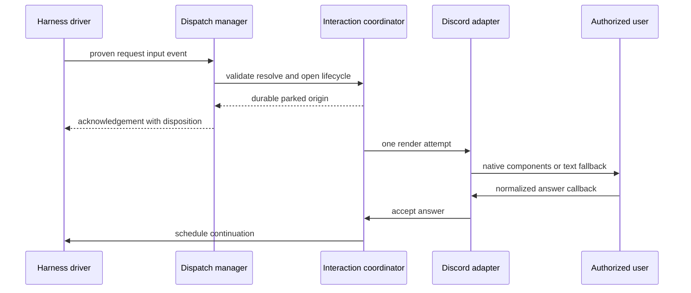
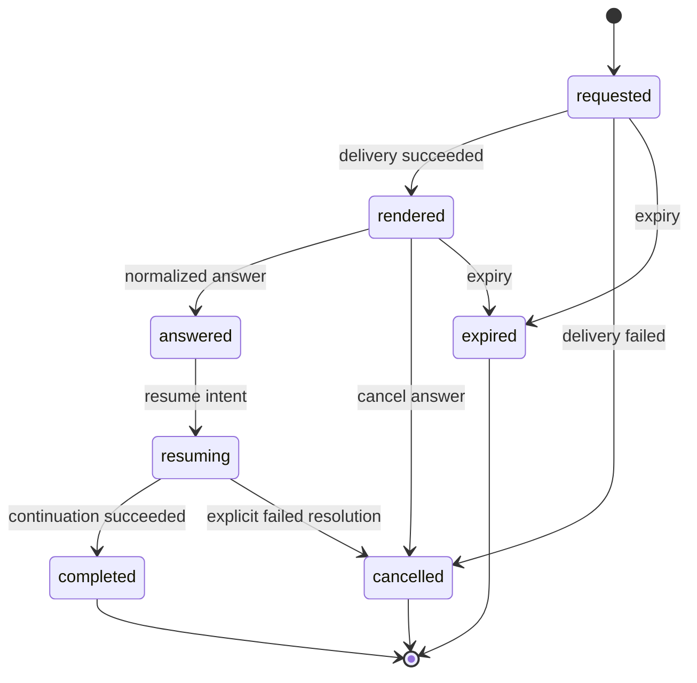

# Managed interactive channel input

Consult this page for the `channel.request_input` protocol and any change to request semantics, durable lifecycle, continuation, or Discord callbacks. It is a managed-channel feature built on the [runtime architecture](runtime-architecture.md): it does not turn hctl into a model loop or general chat UI.

## Contract and trusted ingress

`internal/interaction/interaction.go` defines the portable semantic vocabulary. `Request` contains only request kind, prompt, bounded fields/options, fallback text, and expiry/cancellation policy; `Answer` contains only semantic fields. `DecodeRequest` rejects unknown and duplicate JSON keys, so model input cannot define runtime correlation, vendor callbacks, authorization, paths, or credentials. `ValidateRequest`, `NormalizeAnswer`, and `DigestAnswer` are the canonical semantic and idempotency rules.

Supported request kinds are `confirm`, `choose_one`, `choose_many`, `text`, `date_time`, and `form`. Adapters advertise `Capabilities`; `Resolve` selects native rendering only when every relevant constraint fits, otherwise it requires the authored `fallback_text`. The fallback parser is hctl-owned: `TextFallback` combines the model-authored introduction with fixed instructions and `ParseTextAnswer` interprets only that grammar.

The managed MCP server exposes `channel.request_input` in `internal/mcp/request_input.go`. A harness may create a `RequestInputEvent` only with `harness.NewRootRequestInputEvent` or `NewDeferredRootRequestInputEvent`; the unexported proof is checked by `dispatch.handleRequestInput`. The dispatcher then validates and resolves the request and calls its configured, per-conversation `CoordinatorRequestInputHandler`. Unproven subagent or synthetic events, an unavailable handler, or a request without valid fallback/native rendering are rejected before durable handoff.

This is the managed-channel request path. The initial event is acknowledged only after the request is durably parked; rendering is deliberately later, so waiting does not retain a live model turn.

## Durable lifecycle

`interaction.Lifecycle` stores one pending request per durable conversation record, plus bounded tombstones. `interaction.Coordinator` is the transition owner; its `Store` is implemented by the dispatch conversation store, which atomically parks/completes the originating input with lifecycle changes. Adapters and harness drivers receive narrow interfaces, not independent snapshots.

The visible phase progression is monotonic. Delivery and resume also have internal `pending`, `intended`, `delivered`/`uncertain` and `pending`, `intended`, `failed`/`uncertain` states. These are essential crash boundaries, not retry queues:

- `Request` persists the request and parks the origin before any Discord send. `Render` claims delivery intent before calling the renderer; only one claimant may attempt it.
- A failed render finishes cancelled. An ambiguous render or crash after intent is delivery-uncertain and is **not** automatically redelivered. A valid answer can establish that it reached the user.
- `AcceptAnswer` checks durable owner, expiry, request shape, and normalized digest. Identical answers are duplicates; conflicting or late answers fail. Cancellation finishes immediately.
- `Resume` commits resume intent before invoking a driver. Failure or ambiguity is persisted and not silently retried. `ResolveResume` is explicit operator recovery that completes or fails the state without invoking the harness.
- Terminal outcomes replace the pending record with tombstones containing correlation/owner/answer digests, not raw vendor IDs or semantic request content.

A parked conversation reports `waiting_for_input`, blocks later queued inputs in that conversation, releases active/resident capacity, and preserves an assigned worktree. Other conversations may proceed. On startup, `dispatch.Manager` runs coordinator recovery, schedules expiry, waits for adapter readiness, and only then starts runnable workers or continuations.

## Continuation strategies

The controller chooses continuation based on the driver. A `harness.NativeDeferredToolDriver` uses `native_deferred_tool`; otherwise it uses a `continuation_turn` path.

- **Codex:** `codex.Driver.ContinueTurn` in `internal/harness/codex/continuation.go` opens the persisted thread for one new turn. `continuationText` sends a bounded JSON envelope containing the interaction ID, original request, and normalized answer. A transport loss or session mismatch is uncertain; it does not steer a replacement turn.
- **Claude:** `claude.Driver.ResumeDeferredTool` in `internal/harness/claude/continuation.go` re-enters one exact deferred managed MCP call. `BuildDeferredUpdatedInput` adds the normalized response to a validated request, while `internal/harness/claude/deferred.go` binds the PreToolUse hook, broker exchange, tool-use ID, and input digest. Parallel managed calls, missing retained sessions, or a mismatched envelope are failures; uncertain broker/process outcomes remain uncertain.

Do not collapse these mechanisms into a generic retry: Codex deliberately starts a later thread turn, while Claude resumes an exact native tool invocation. Both rely on the manager for capacity, workspace selection, and durable ordering.

## Discord adapter

`discord.Runtime` implements `interaction.Renderer` and the controller’s interaction adapter. `Capabilities` accepts confirmations, non-freeform choices, text, and text-only forms with Discord-specific limits; date/time, freeform choices, mixed forms, and other unsupported shapes require text fallback.

`Runtime.Render` consumes a remembered reply target only after coordinator intent is durable. It renders small single choices as buttons, larger/single or multi-choice requests as string selects, and text/forms through an Answer button followed by a modal. Components use a versioned digest handle plus positional action, never semantic IDs, channel/session IDs, authorization values, or credentials. Fallback messages carry an opaque marker; only a reply to the current marked bot message bypasses ordinary FIFO input.

`handleComponent` verifies application, allowed human, configured guild/channel or DM, reconstructed conversation, durable owner, current interaction handle, callback shape, and positional values before `AcceptInteraction`. It commits the normalized answer before acknowledging Discord, and schedules continuation only after acceptance. Acknowledgement failure does not roll back the answer. `recoverSurface` reconstructs the configured guild target and idempotently renders a pending delivery on startup; intended/uncertain deliveries are not automatically repeated.

## Change recipes and tests

| Change | Complete surface and non-goals | Focused behavioral checks | Narrow validation |
| --- | --- | --- | --- |
| Add a request field/kind or modify normalization | Update `Request`/`Field`, `ValidateRequest`, `NormalizeAnswer`, `RequestJSONSchema`, text grammar/parser, and capability resolution. Update the MCP schema consumer rather than adding adapter-only semantics. Do not add runtime/callback fields to the portable contract. | `TestConformanceFixtures`, `TestValidateRequestBoundsAndUnion`, `TestResolveNativeFallbackAndFailure`, `TestTextGrammarAndParser` in `internal/interaction/interaction_test.go`; schema test. | `go test ./internal/interaction ./internal/mcp` |
| Change lifecycle/recovery semantics | Update `Lifecycle.Validate`, `Coordinator`, and dispatch store atomic mutations together. Preserve one pending request, commit-before-effect, terminal tombstones, owner checks, no automatic replay after ambiguity, and origin/queue atomicity. | `TestCoordinatorNeverRetriesAmbiguousEffects`, `TestCoordinatorAnswerOwnershipIdempotencyAndConflict`, `TestCoordinatorCrashBoundariesDoNotRepeatSideEffects`; `TestCoordinatorAtomicallyParksAndCompletesDispatcherOrigin`; store rollback/gating tests. | `go test ./internal/interaction ./internal/dispatch` |
| Add a channel adapter or change Discord rendering | Implement `interaction.Renderer`, capabilities, owner derivation, recovery target, callback decoding, and controller wiring. Keep vendor payloads process-local and call `NormalizeAnswer`; adapter rendering must not write durable state directly. | Discord capability, opaque-component, callback-order, callback-provenance, fallback, and restart suites: `TestDiscordCapabilitiesDegradeMixedFormsAndFreeformChoices`, `TestDiscordCallbackCommitsBeforeAcknowledgementAndContinuation`, `TestDiscordCallbacksFailClosedOnProvenanceAndMalformedData`, `TestDiscordRestartReattachesGuildTargetBeforeRecoveredContinuation`. | `go test ./internal/channel/discord ./internal/channel/controller` |
| Change a harness continuation | Preserve the matching continuation mode, manager-owned capacity and lifecycle, exact correlation, and uncertain-without-retry behavior. A driver unit passing is insufficient if controller selection or dispatch scheduling changes. | Codex `TestContinuationResumesSameThreadForStructuredNewTurn` and `TestContinuationTransportLossIsUncertainAndNeverSteers`; Claude `TestDeferredHookDefersThenAllowsOnlyExactCall`, `TestStreamJSONResumesWithoutNewUserPromptAndClassifiesFailures`, `TestDeferredResumeClassifiesBrokerWriteFailureUncertain`; manager continuation tests. | `go test ./internal/harness/codex ./internal/harness/claude ./internal/dispatch` |

For cross-boundary work—MCP tool schema, manager configuration, controller selection, driver registration, or Discord runtime wiring—run `go test ./internal/mcp ./internal/dispatch ./internal/channel/controller ./internal/channel/discord ./internal/harness/claude ./internal/harness/codex`. The full `./scripts/check.sh` remains conditional and expensive as described in [quickstart](quickstart.md); live Discord and model acceptance are not part of its default credential-free suite.
