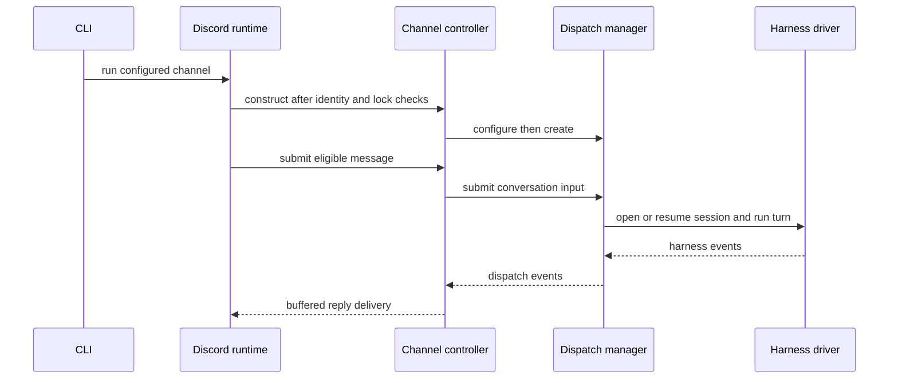

# Runtime architecture

Consult this page when changing command wiring, portable-agent compilation, managed runtime admission, or the channel controller. For the human-input protocol that this runtime delegates to, see [interactive input](interactive-input.md).

## Ownership boundary

An agent source directory has required `instructions.md` and convention-discovered optional skills, tools, subagents, connections, channels, schedules, plugins, and harness-specific trees. `project.Load` in `internal/project/project.go` validates this portable source and produces the project representation consumed by setup and runtime. `setup.Apply` writes hctl-owned native artifacts, while `tool.Prepare` establishes tool-host dependencies before apply completes.

`cmd/hctl/main.go` enters `cli.Run`. `internal/cli/cli.go` routes `apply`, `run`, `channel`, `schedule`, internal `mcp`, and internal Claude hook commands. `runApply` loads the project, verifies the selected harness, prepares tool hosts, resolves the executable path, and invokes setup. `runAgent` chooses either JSONL dispatch or a configured channel runtime.

The selected native harness owns model calls, context, planning, native tools, approvals, and user-facing native UX. Hctl owns generated setup and only the tools and state that cross its managed boundary. In particular, a managed MCP request is not proof that arbitrary harness activity is controlled.

## Managed channel composition

This shows the normal managed-channel path. The interactive detour from a harness event is documented on [interactive input](interactive-input.md).

`discord.Runtime.Run` validates the bot identity and configured profile, acquires a per-application lock, starts `controller.New`, registers commands, opens the gateway, and recovers the configured guild surface. `controller.New` constructs a `dispatch.Manager` and passes a configuration callback before admission starts. The callback is the security-sensitive seam: it installs the per-conversation request-input factory and readiness check only when an interaction adapter is present.

`dispatch.Manager` owns durable conversation workers, queue/capacity coordination, state-store recovery, expiry timers, and worktree reconciliation. A conversation can be inactive, idle, queued, active, waiting for input, or hibernated. The manager uses one durable store shared across its conversation workers; no transport adapter independently saves conversation snapshots. `channel/controller.Controller` maps channel surfaces to conversations, buffers ordinary output, and delegates scheduling to the manager while keeping vendor values out of dispatch state.

## Change rules and narrow checks

| Area | Start here | Invariants to preserve | Focused validation |
| --- | --- | --- | --- |
| CLI surface | `internal/cli/cli.go` | Internal commands such as `mcp` and `hook` are not part of the public help surface; command handlers validate inputs before side effects. | `go test ./internal/cli` |
| Agent compilation/setup | `internal/project/project.go`, `internal/setup/setup.go` | Validate before workspace mutation; hctl-owned destinations stay reserved; authored source and workspace stay separate. | `go test ./internal/project ./internal/setup` |
| Dispatcher | `internal/dispatch/manager.go`, `internal/dispatch/dispatch.go` | Capacity and durable state are manager-owned; recovery occurs before admission; a waiting conversation does not execute later queued work. | `go test ./internal/dispatch` |
| Channel controller | `internal/channel/controller/controller.go` | A surface cannot silently change conversation identity; controller configuration precedes admission; channel adapters do not own durable state. | `go test ./internal/channel/controller` |

Changing public generated setup also requires shipped-surface validation, not only an internal test: use `go test ./internal/project ./internal/setup ./internal/mcp`, then run an `hctl apply` smoke test only in a disposable workspace with an available selected harness. Generated workspace files are derived output—change their canonical setup source, never hand-edit a generated mirror.

## Boundaries

The dispatcher is shared infrastructure, but schedule triggering and the regular JSONL path do not automatically gain Discord interaction behavior. `channel.request_input` is accepted only through the managed channel root gate described in [interactive input](interactive-input.md). Credential material is intentionally outside this wiki and should not enter source, tests, durable dispatch records, or generated documentation.
